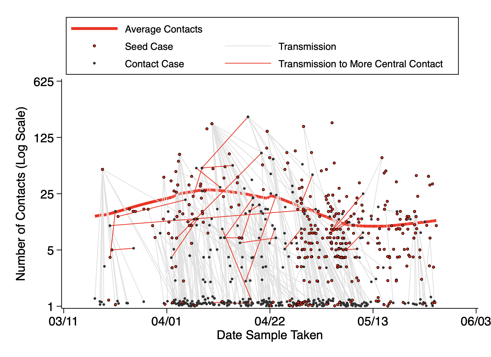
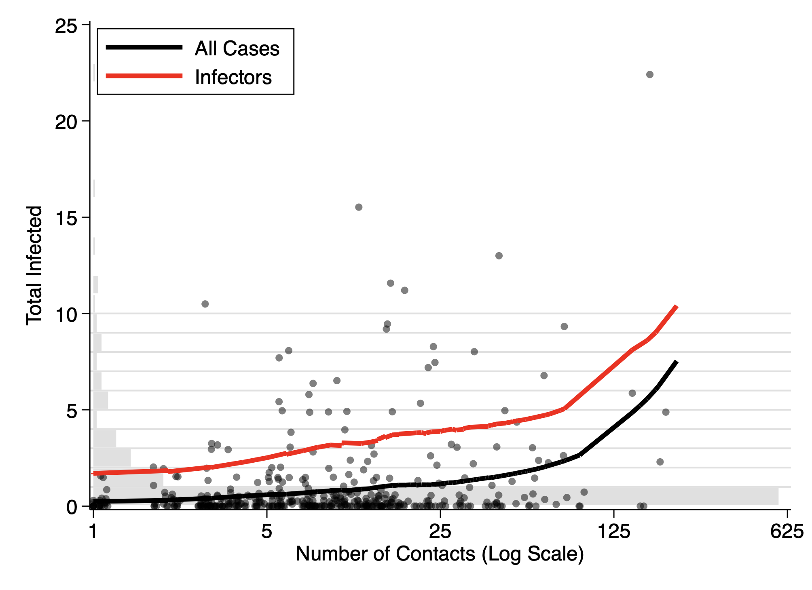

# Contact Tracing

## Figure. Contact Tracing vs. Total Testing

## Figure. Local Transmission Map

## Figure. Network of Contacts (Ex. Zero Infectors)

## Figure. Distribution of Contacts (Ex. Zeros)

## Figure. Distribution of PCI vs Contacts (Ex. PCI Zeros)

## Figure. Cumulative Distribution of Infections

## Figure. Distribution of Infected vs Contacts (Ex. Zeros)
**Note:** Exact points randomly jittered to show density.

## Appendix Figure 2. Log-Rank Plot of Contacts

**Note:** Linear fit equation y = (1.0065^(x+100)).
Size of bubble indicates relative number of observations.

