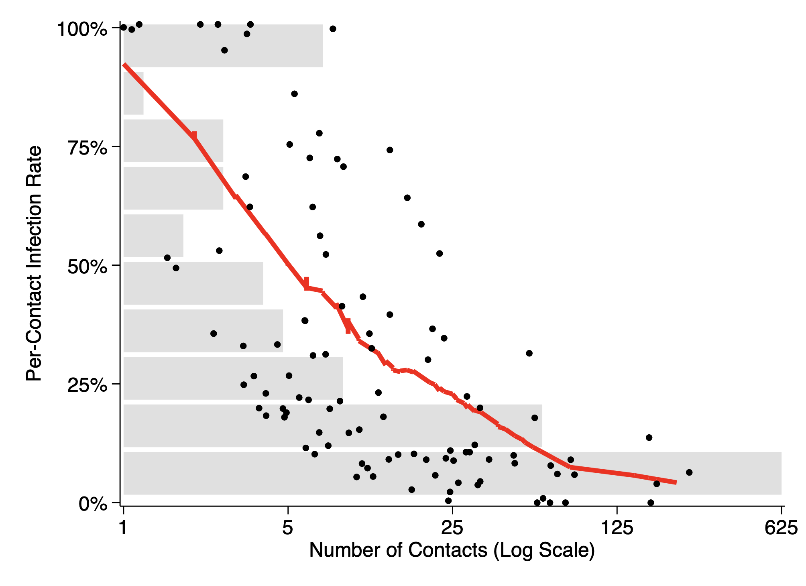

# Contact Tracing

## Figure 1. Distribution of Contacts (Ex. Zeros)

## Figure 2. Distribution of PCI vs Contacts (Ex. PCI Zeros)

## Appendix Figure 2. Log-Rank Plot of Contacts

**Note:** Linear fit equation y = (1.008^(x+80)).
Size of bubble indicates relative number of observations.

