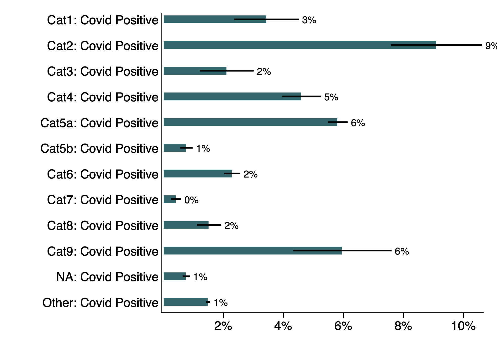

# Miscellaneous Results

## Positivity by category

- Cat 1: Symptomatic international traveller in last 14 days
- Cat 2: Symptomatic contact of lab confirmed case
- Cat 3: Symptomatic Healthcare worker / Frontline workers
- Cat 4: Hospitalized SARI (Severe Acute Respiratory Illness) patient
- Cat 5a: Asymptomatic direct and high risk contact of lab confirmed case - family member
- Cat 5b: Asymptomatic healthcare worker in contact with confirmed case without adequate protection
- Cat 6: Symptomatic Influenza like Illness (ILI) in Hospital
- Cat 7: Pregnant woman in / near labour
- Cat 8: Symptomatic (ILI) among returnees and migrants (within 7 days of illness)
- Cat 9: Symptomatic Influenza like Illness (ILI) patient in Hotspot / Containment zones